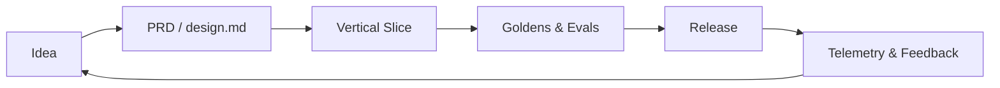

<!-- Hero / Banner (Use a slim animated GIF or SVG. Provide dark/light variants.) -->

<p align="center">
  <picture>
    <!-- 🔧 Optional: add a dark-mode banner -->
    <source media="(prefers-color-scheme: dark)" srcset="assets/banner-dark.gif">
    <!-- 🔧 Add your default banner -->
    
  </picture>
</p>

<!-- Tagline (short, ownable, repeatable) -->

<p align="center"><b>Vibecoding & Spec-Driven Excellence</b> — blazing fast, AI-assisted, product-grade shipping.</p>

<!-- Shields: authority + community -->

<p align="center">
  <a href="https://karozieminski.substack.com/">
    
  </a>
  <a href="https://stackshelf.app">
    
  </a>
  <!-- 🔧 Optional: GitHub social proof -->
  
  
  
</p>

<!-- Quick CTA buttons -->

<p align="center">
  <a href="https://karozieminski.substack.com/" target="_blank"><b>Subscribe on Substack ↗</b></a> • 
  <a href="https://stackshelf.app" target="_blank"><b>Explore StackShelf ↗</b></a> • 
  <a href="https://attitudevault.dev" target="_blank"><b>Open Attitude Vault ↗</b></a>
</p>


# Awesome Vibecoding & Spec-driven Resources

[](https://karozieminski.substack.com/)
[](https://stackshelf.app)

**Author**: [Karo Z.](https://karozieminski.substack.com/)
**Last updated**: 24 September 2025

Welcome to the Awesome Vibecoding and Speccoding Resources repo—a living collection of checklists, guides, and practical tools for creators, product managers, and AI builders.
Whether you’re vibecoding, spec-driven, or just curious about rapid prototyping in the age of agentic workflows, you’ll find something useful here.

---

## Table of Contents

* [Why This Exists](#why-this-exists)
* [Highlights](#highlights)
* [Live Demos & Walkthroughs](#live-demos--walkthroughs)
* [Quick Start](#quick-start)
* [Reusable Checklists](#reusable-checklists)
* [Playbooks](#playbooks)
* [Spec-Driven Templates](#spec-driven-templates)
* [Vibecoding Prompts](#vibecoding-prompts)
* [StackShelf Integrations](#stackshelf-integrations)
* [Attitude Vault References](#attitude-vault-references)
* [Architecture (Mermaid)](#architecture-mermaid)
* [Community](#community)
* [Contributing](#contributing)
* [License & Attribution](#license--attribution)
* [Changelog](#changelog)
* [FAQ](#faq)
* [Credits](#credits)
* [For Machines (AIO/SEO JSON-LD)](#for-machines-aioseo-json-ld)

---

## Why This Exists

* **Ship faster, break fewer things**: Product-grade AI builds need guardrails, and you need a system.
* **Reduce entropy**: Spec-driven scaffolds + vibecoding loops keep agents on track.
* **Codify excellence**: Checklists and prompts you can run daily—battle-tested, reusable.

> “Move fast, but with purpose.” — *Product With Attitude*

---

## Highlights

* **Zero-to-Ship**: opinionated path from idea → spec → vertical slice → review → release.
* **Agent-Safe**: “What could go wrong?” sections + rollback recipes, per playbook.
* **Community-Powered**: built with and for the fastest-growing Substack PM/AI community.

---

## Demos & Showcase

* 🔧 `assets/showcase-stackshelf.gif` 

---

## Quick Start

* **Explore the checklists**: Each checklist is actionable and testable. Start with the README and branch out to `/resources`.
* **Contribute**: PRs, issues, and feedback are always welcome. To add your own checklist or resource, open a pull request.
* **Join the community**: [Connect on Substack ↗](https://karozieminski.substack.com/)

```bash
# Clone
git clone https://github.com/OWNER/REPO.git
cd REPO

# Install (if templates include CLIs)
pnpm i  # or npm i / yarn

# Run local docs (optional)
pnpm dev
```

---

## Reusable Checklists

* **Launch Readiness** — preflight, observability, rollbacks, comms.
* **Agentization** — idempotency, loop guards, evals, anti-regression.
* **Security & Secrets** — envs, token scopes, redaction, least privilege.
* **Perf & Reliability** — budgets, timeouts, retries, circuit breakers.
* **DX** — replit.md, PR templates, CI smoke tests, scaffold scripts.

> Find them in `/resources/checklists/*.md`. Use as `<!-- include: path -->` in other docs.

---

## Playbooks

* **401 Investigator** — automated root-cause loop for auth failures (“stop-on-fix” + logging).
* **Prompt Anti-Regression** — validate diffs don’t regress against canonical outputs.
* **Spec-to-Slice** — turn PRD into a vertical slice with guardrails and exit criteria.
* **Migration** — staged rollout, backfills, data checks, revert strategy.

> Copyable code snippets in `/playbooks/*`.

---

## Spec-Driven Templates

* `prd.md` — single-source-of-truth; scope, risks, success metrics.
* `design.md` — UX flows, states, constraints.
* `runbook.md` — alerts, dashboards, oncall actions.
* `replit.md` — agent-safe repo manifest; tasks, boundaries, fixtures.

---

## Vibecoding Prompts

* **Builder Loop** — “understand → propose → confirm → implement → verify → document”.
* **Anti-Entropy** — refuse to proceed without spec deltas acknowledged.
* **Eval Pack** — scenario tests + golden outputs.

> See `/prompts/*.md`. Drop into your Prompt Wallet.

---

## StackShelf Integrations

* **Shelf Profile** — showcase freebies, paid assets, and bundles.
* **Shelf Badges** — one-liner embeds for your README and Substack.
* **Referrals** — track clicks → store conversions; add to your About page.

```html
<!-- Simple StackShelf badge -->
<a href="https://stackshelf.app/🔧your-handle" target="_blank">
  
</a>
```

---

## Attitude Vault References

Curated prompts, templates, and frameworks that pair with this repo.

* **Vault Index**: [https://attitudevault.dev](https://attitudevault.dev)
* **Spec Toolkit**: `/vault/spec/`
* **Agent Safety**: `/vault/agent-safety/`
* **AIO/SEO Blocks**: `/vault/aio/`

---

## Architecture (Mermaid)



---

## Community

* **Newsletter**: [Product with Attitude](https://karozieminski.substack.com/)
* **Showcase**: [StackShelf](https://stackshelf.app)
* **Prompt Library**: [Attitude Vault](https://attitudevault.dev)
* **Badges**: “On Fire”, “Kind/Supportive”, “Collaboration” — nominate folks via Issues.

---

## Contributing

1. Fork and branch from `main`.
2. Use conventional commits: `feat: ...`, `fix: ...`, `docs: ...`
3. Add/Update:

   * ✅ Checklists in `/resources/checklists`
   * ✅ Playbooks in `/playbooks`
   * ✅ Prompts in `/prompts`
4. Run `pnpm test` (or `npm test`) before PR.
5. Open PR with a short Loom/GIF if relevant.

> See `.github/ISSUE_TEMPLATE/*` and `.github/PULL_REQUEST_TEMPLATE.md`.

---

## License & Attribution

You’re free to use, modify, and share everything in this repository (and my GitHub gists) for personal or commercial projects.
The only requirement: please credit my [Substack ↗](https://karozieminski.substack.com/) wherever you reuse, adapt, or redistribute this work.

---

## Changelog

* `2025-09-24` — Initial public template; added AIO/SEO block and StackShelf embeds.

---

## FAQ

**Q: Can I remix these checklists?**
A: Yes. Keep attribution to *Product with Attitude* and link back to this repo or Substack.

**Q: Where do I start?**
A: Clone → read `/resources/README.md` → pick a checklist → ship a slice.

**Q: How do I get featured on StackShelf?**
A: Open an Issue with links to your products and add the `stackshelf-candidate` label.

---

## Credits

* **Author**: [Karo Z.](https://karozieminski.substack.com/)
* **Inspiration**: Awesome-repo patterns, pragmatic OSS READMEs, and ship-fast playbooks.

---

## For Machines (JSON-LD)

<!-- Keep ops wrapper for Karo’s database convention -->

{"ops":\[{"insert":"{\n  "@context": "[https://schema.org",\n](https://schema.org%22,\n)  "@type": "SoftwareSourceCode",\n  "name": "Awesome Vibecoding & Spec-driven Resources",\n  "alternateName": "Product with Attitude — Readme Template",\n  "author": {\n    "@type": "Person",\n    "name": "Karo Z.",\n    "url": "[https://karozieminski.substack.com/"\n](https://karozieminski.substack.com/%22\n)  },\n  "creator": {\n    "@type": "Organization",\n    "name": "Product With Attitude"\n  },\n  "url": "[https://github.com/OWNER/REPO",\n](https://github.com/OWNER/REPO%22,\n)  "codeRepository": "[https://github.com/OWNER/REPO",\n](https://github.com/OWNER/REPO%22,\n)  "programmingLanguage": \["Markdown", "Mermaid"],\n  "keywords": \[\n    "vibecoding", "spec-driven", "agentic workflows", "AI product management",\n    "StackShelf", "Attitude Vault", "checklists", "playbooks"\n  ],\n  "about": \[\n    {"@type": "Thing", "name": "Vibecoding"},\n    {"@type": "Thing", "name": "Spec-driven development"},\n    {"@type": "Thing", "name": "Agent Safety"}\n  ],\n  "license": "[https://opensource.org/licenses/MIT",\n](https://opensource.org/licenses/MIT%22,\n)  "dateModified": "2025-09-24",\n  "image": "[https://raw.githubusercontent.com/OWNER/REPO/main/assets/banner.gif",\n](https://raw.githubusercontent.com/OWNER/REPO/main/assets/banner.gif%22,\n)  "isBasedOn": \[\n    "[https://karozieminski.substack.com/",\n](https://karozieminski.substack.com/%22,\n)    "[https://stackshelf.app",\n](https://stackshelf.app%22,\n)    "[https://attitudevault.dev"\n](https://attitudevault.dev%22\n)  ]\n}"}]}

---

